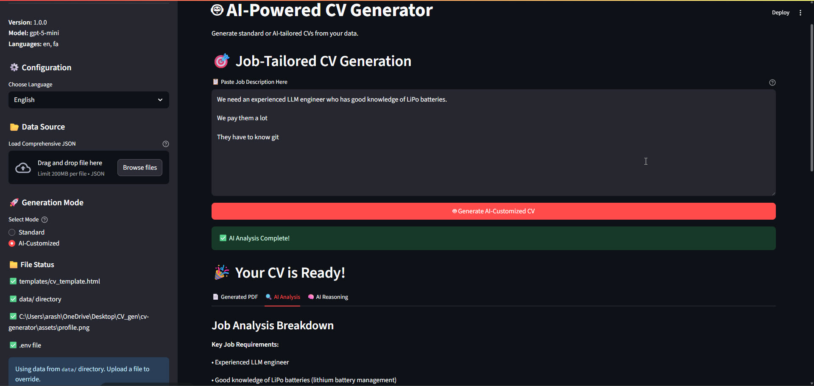

# 🤖 AI-Powered CV Generator

A web-based application built with Streamlit that generates professional, high-quality CVs from your personal data. It features two modes: a standard PDF generator and an AI-powered mode that customizes your CV for a specific job description using the OpenAI API.

---

## ✨ Key Features

-   **Dual Generation Modes**: Generate a standard PDF from your JSON data or have the AI customize it for a specific job description.
-   **Intelligent Content Optimization**: AI strategically highlights your relevant skills and experiences based on job requirements, without fabricating information.
-   **Multi-Language Support**: Supports English (LTR) and Farsi (RTL).
-   **Separation of Concerns**: CV data in JSON files, separate from the presentation layer.
-   **Customizable Templates**: Easily modify the CV's appearance using Jinja2 HTML and CSS.
-   **High-Quality PDF Output**: Generates crisp PDFs using WeasyPrint.
-   **Interactive Web UI**: User-friendly interface powered by Streamlit.

---

## 💻 Tech Stack

-   **Backend & UI**: Python, Streamlit
-   **AI Integration**: OpenAI API
-   **Templating**: Jinja2
-   **PDF Generation**: WeasyPrint
-   **Data Handling**: JSON

## 🚀 Getting Started

For detailed installation, setup, and configuration instructions, please refer to the **[SETUP README](docs/setup.md)**.

---

## 🎨 Customization

Details on modifying the CV design and adding new sections can be found in the **[CUSTOMIZATION README](docs/customization.md)**.

---

## 📜 License

This project is licensed under the MIT License. 